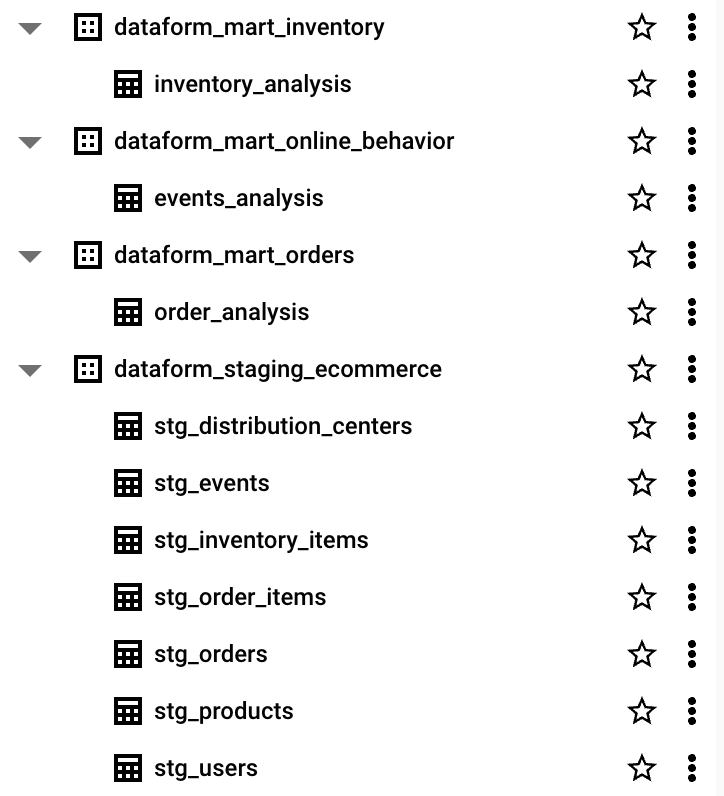
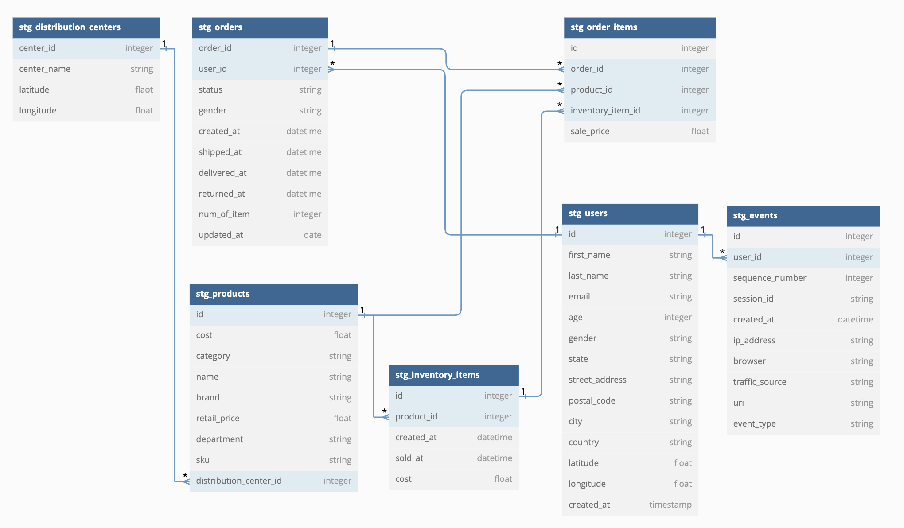
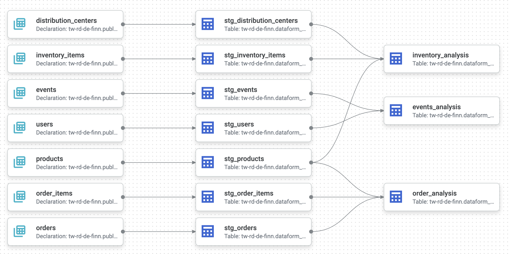
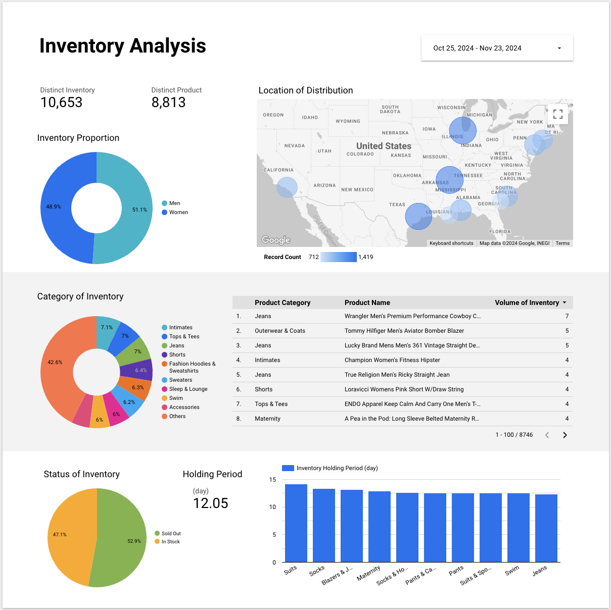
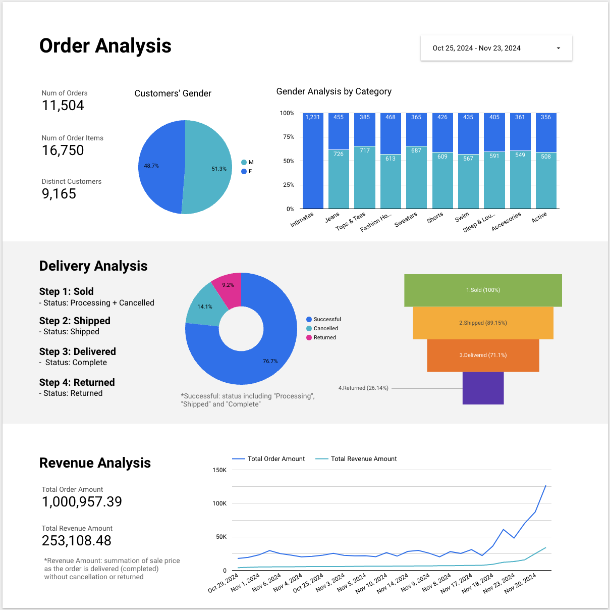
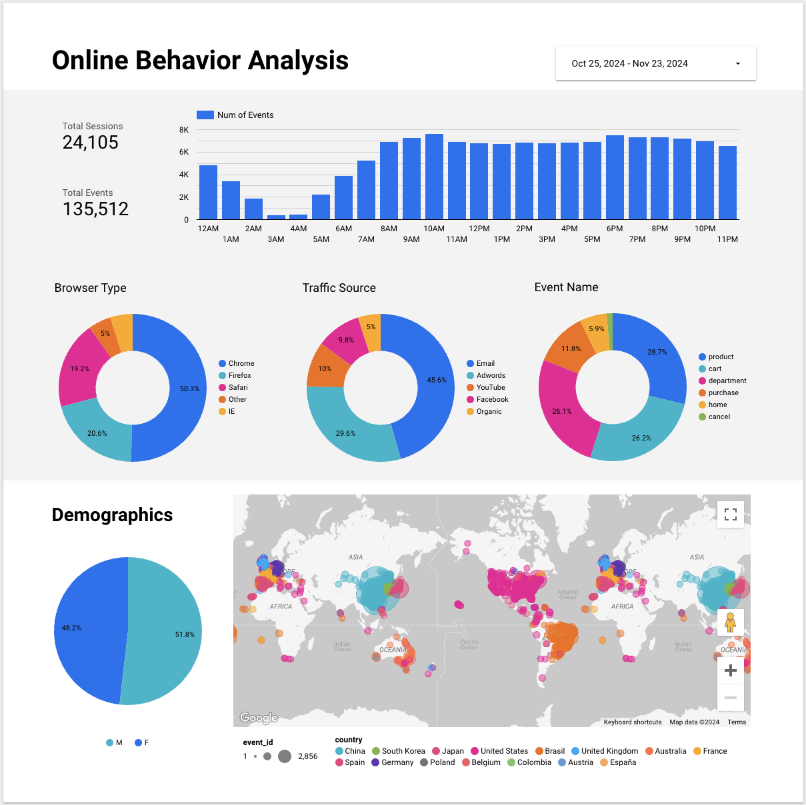
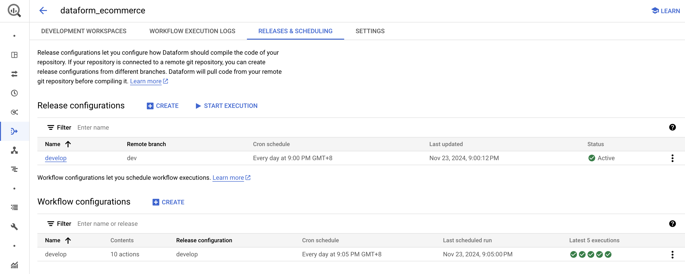

# BigQuery Dataform Ecommerce Pipeline

## Purpose
To find the ecommerce insights on inventory, orders and user online behavior, building a data transformation pipeline with Dataform.

## Data Warehouse Structure
You can figure out the data warehouse structure in this following diagram, which follows the recommendation of [dbt's official documents about data structure](https://docs.getdbt.com/best-practices/how-we-structure/1-guide-overview) wo distinguish the staging zone and data mart zone.

## Data Model and Lineage Overview
You can know more about ER (Entity and Relationship) model and pipeline flow of ETL (Extract, Transform, Load), which follows the recommendation of [dbt's offical documents about data modeling technique](https://www.getdbt.com/analytics-engineering/modular-data-modeling-technique)

## Data Visualization
Find some insights about inventory purchase status, order details and online user behavior with visualization tool like Looker studio.
[Looker Studio Dashboard](https://lookerstudio.google.com/reporting/15f6cd0f-b326-40aa-82b4-7f9310ab6338)
- Inventory Analysis:
    
- Order Analysis:
    
- Online Behavior Analysis
    

## Execution Guide
### Permission
1. Your user account: 
    - `Dataform Admin`
2. Datadorm default service account: 
    - `BigQuery Data Editor`, or `BigQuery Data Owner`
    - `BigQuery Job User`

### Preparation
1. Create a Dataform repository.
2. Create a new development workspace.
3. Setup data source: fetch BigQuery public data `bigquery-public-data.thelook_ecommerce` and rename to `public_thelook_ecommerce` in region `asia-east1`.

### Dataform transformation
Pull this GitHub repo and sync to your dataform repository.

### Trigger daily workflows
Dataform compiles SQL workflow code into a compilation result. You can use them to create execution environments

1. Release configurations: configure how Dataform should compile the code of your repository.
2. Workflow configurations: configure how often you schedule workflow executions with specific release result.